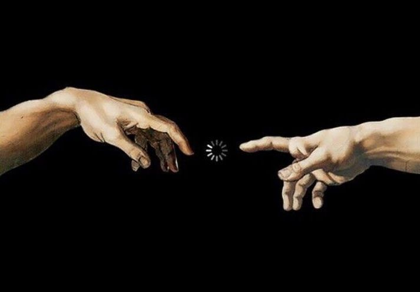

  

# Hi there, I'm Dorian 👋

<h3 align="center" style="color:#6e5494;font-family:monospace;">✨ art through code ✨</h3>

  

---

## 🚀 About Me

- � Linux enthusiast and Arch user, passionate about customizing environments with Hyprland
- 🔒 Cybersecurity advocate exploring the depths of digital security
- � Fascinated by interconnectivity, networking, and distributed systems
- 🧮 Algorithm enthusiast who loves solving complex computational problems
- 💡 I believe in the intersection of creativity, security, and technology
- 📫 How to reach me: **[Your Email]**

---

## 🛠️ Languages and Tools

  

  
  
  
  
  
  
  
  

---

## 📊 GitHub Stats

  

  

---

## 🤝 Connect with me

  
  
  

---

  <i>⭐️ From [Kalytheos](https://github.com/Kalytheos)</i>

